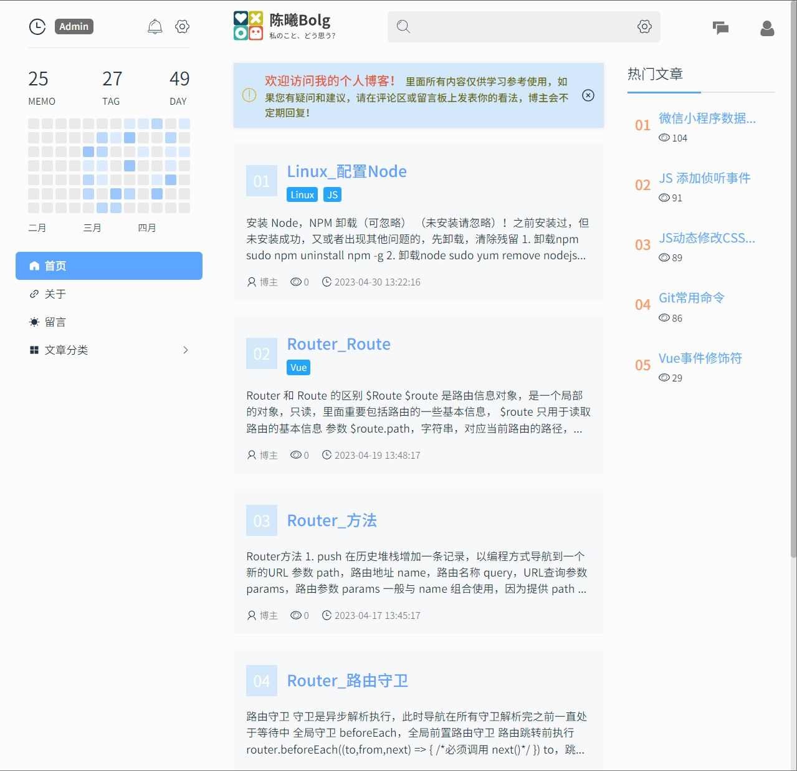
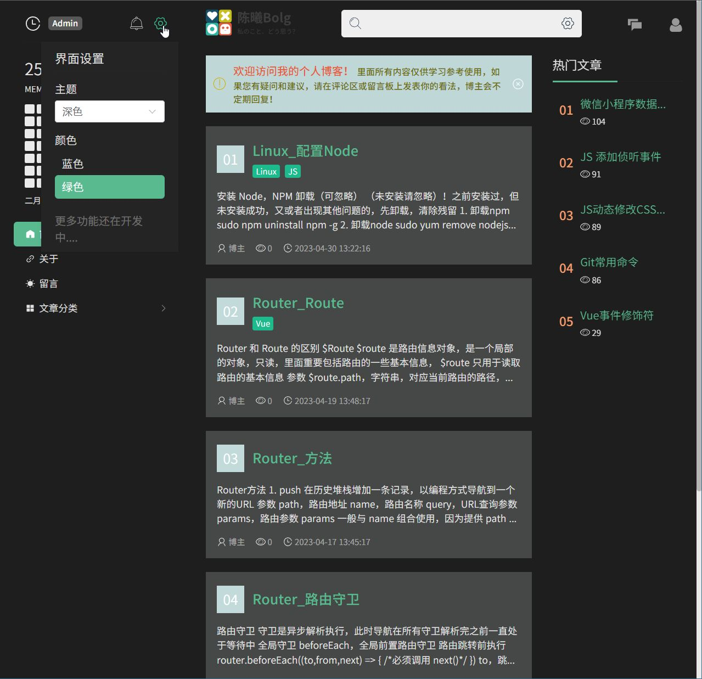
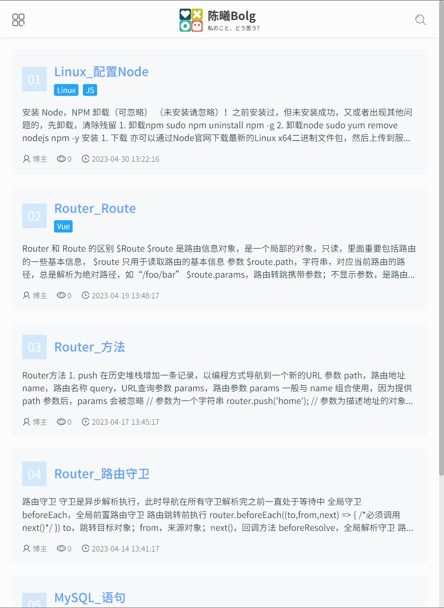
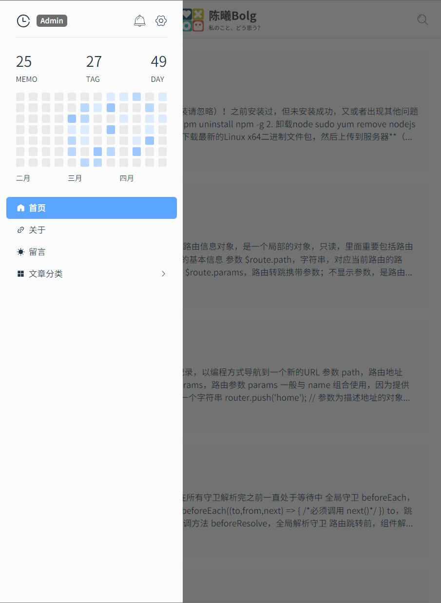
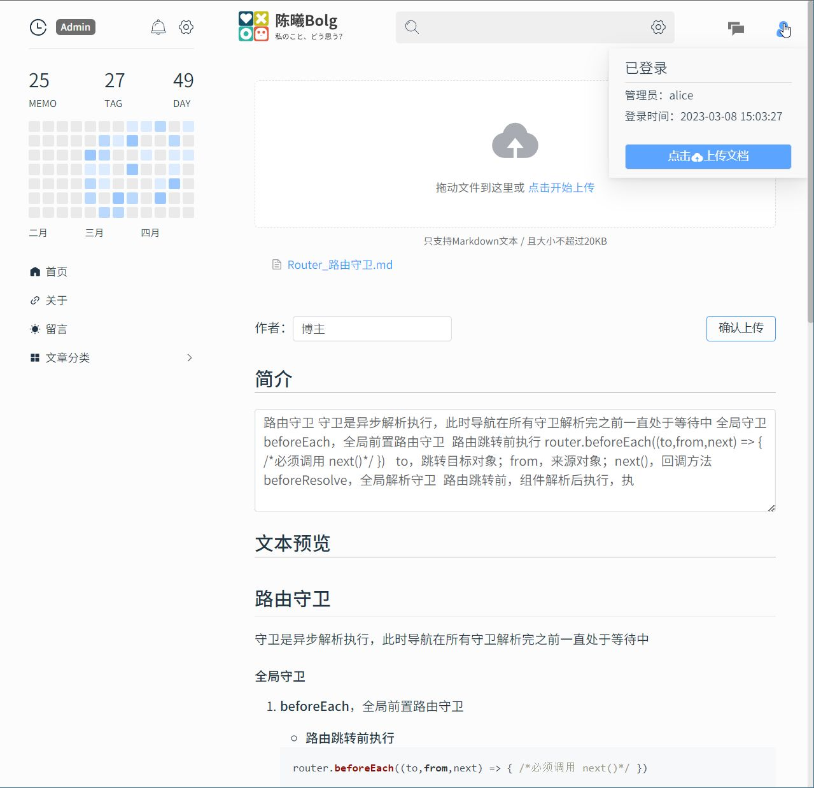

# Blog

> 声明：此项目只发布于 Github，基于 MIT 协议，免费且作为开源学习使用。

### 介绍

本项目为个人开发的开源博客，本项目基于以下的技术：

- 客户端(Client)：Vue3 + Vite + Element Plus

- 服务端(Server)：NodeJS-Express + MySQL

Demo展示：https://www.waowaowao.cn

**功能实现**：

1. 响应式布局，适配多端设备；
2. 深/浅 色主题切换，可更换主颜色；
3. 登录验证，文件上传。

## 使用

### 后端

进入Server目录下，安装依赖

```shell
npm install
```

**数据库**：在MySQl中执行 `blog.sql`，脚本会创建一个名为 blog 的数据库和一些表。

在 /config 目录下的 `db.js` 配置数据库信息

```js
const secret = require("./secret"); // 删除这行
const pool = mySql.createPool({
  host: secret.host, // 数据库地址
  port: secret.port, // 端口
  user: secret.user, // 用户
  password: secret.password, // 密码
  database: "blog",
  connectionLimit: 20,
});
```

**运行**：服务默认监听 6927 端口。你可以在 `app.js` 中修改端口，位置在 `httpServer.listen("6927")` 。

```shell
npm start
```

### 前端

进入Client目录下，安装依赖

```shell
npm install
```

在 /src/api 目录下的 `axios.js` 配置后端地址

```js
import secret from "./secret"; // 删除这行
const API = axios.create({
  baseURL: secret.baseURL, // 服务器地址 127.0.0.1:6927
  timeout: 60000,
  changeOrigin: true,
});
```

**运行**：服务默认在 4687 端口启动

```shell
npm run dev
```

### Demo展示

主题切换：





响应式设计：





文件上传：

